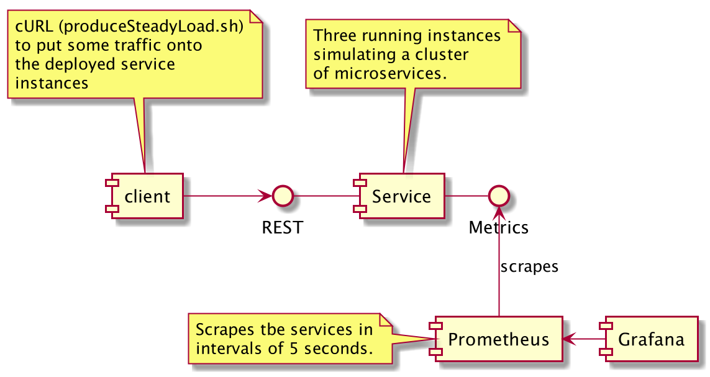

# Metrics with Microprofile

This project contains a dockerized setup of 

- a custom microprofile service written using [Quarkus][quarkus] (docker-compose will start three instances of that service)
- a [prometheus][prometheus] server which scrapes those service-instances
- a [grafana][grafana] server which charts the scraped data

## Prerequisites to run the example

In order to run this example you'll need:

- a JDK v8 installed on your machine (to compile the services source-code)
- [docker][docker] and docker-compose to build and start the mentioned containerized services

## Running the example

There are two `bash`-scripts contained which can be used to build and start everything up: 

```
$> ./buildAndRun.sh         # will compile the sources, build/download 
                            # docker-contianers and finally start everything up
$> ./produceSteadyLoad.sh   # uses curl to put some load on the services
```

After starting the stack you can access Prometheus at http://localhost:9090 - Grafana listens
on http://localhost:3000. But Grafana needs some more preparations.



* When opening Grafana you can login using _admin/admin_ (and skip further user-setup). 
* After that, you'll have to define a datasource. As members of a docker-network the services can access each other using their docker-compose service-names. So, define a new Prometheus-DataSource and enter http://prometheus:9090 as destination.
* Finally, create a new dashboard by importing the file `grafana_dashboard.json` from this repo

That's it.

[quarkus]:https://quarkus.io/
[docker]:https://www.docker.com/products/docker-desktop
[prometheus]:https://prometheus.io/
[grafana]:https://grafana.com/oss/grafana/